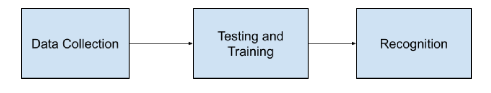
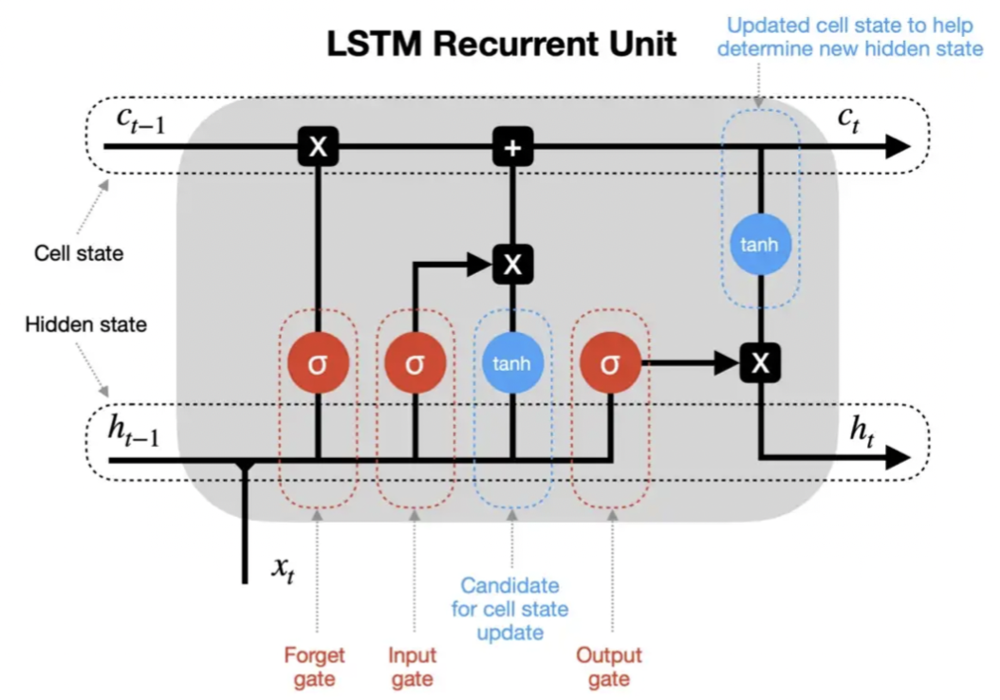

# Sign-Language-Prediction

Sign language recognition is a project that uses technological breakthroughs to help those who are visually impaired. We intended to construct a sign detector for this reason. We are attempting to recognize and display messages based on hand movements with this project. The advancement of existing technologies, as well as extensive study, are employed to help the deaf and dumb. Because comprehending sign language is not something that many people have, this can be highly valuable for deaf and dumb people connecting with others. Python modules such as OpenCV, Tensorflow, and Keras are needed to complete this project.

## Problem Statement
When hand and other movements are employed in sign language, a sign detector is utilized to identify them. Based on these unique movements, the detector then shows signals for the persons who require special assistance. In this context, machine learning and computer vision ideas can be applied.

## Architecture Diagram
The architecture of the model for recognizing sign language offers a guide and suitable methods to use when creating a well-structured application that meets our requirements. Three phases primarily comprise this architecture:

## LSTM
An artificial neural network called Long Short-Term Memory (LSTM) is employed in deep learning and artificial intelligence. LSTM features feedback connections as opposed to typical feedforward neural networks. Such a recurrent neural network (RNN) may analyze whole data sequences in addition to single data points (such as photos). For instance, LSTM can be used for applications like speech recognition, robot control, machine translation, networked, unsegmented handwriting recognition, video games, and healthcare.

