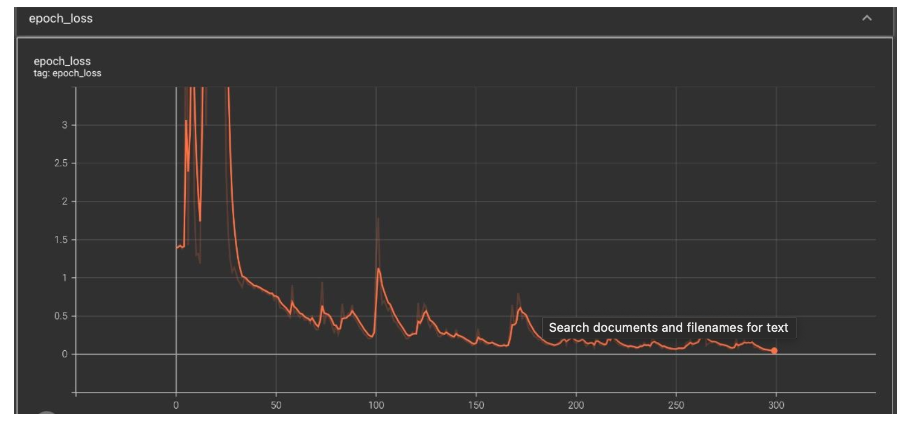

# Sign-Language-Prediction

Sign language recognition is a project that uses technological breakthroughs to help those who are visually impaired. We intended to construct a sign detector for this reason. We are attempting to recognize and display messages based on hand movements with this project. The advancement of existing technologies, as well as extensive study, are employed to help the deaf and dumb. Because comprehending sign language is not something that many people have, this can be highly valuable for deaf and dumb people connecting with others. Python modules such as OpenCV, Tensorflow, and Keras are needed to complete this project.

## Problem Statement
When hand and other movements are employed in sign language, a sign detector is utilized to identify them. Based on these unique movements, the detector then shows signals for the persons who require special assistance. In this context, machine learning and computer vision ideas can be applied.

## Architecture Diagram
The architecture of the model for recognizing sign language offers a guide and suitable methods to use when creating a well-structured application that meets our requirements. Three phases primarily comprise this architecture:

## LSTM
An artificial neural network called Long Short-Term Memory (LSTM) is employed in deep learning and artificial intelligence. LSTM features feedback connections as opposed to typical feedforward neural networks. Such a recurrent neural network (RNN) may analyze whole data sequences in addition to single data points (such as photos). For instance, LSTM can be used for applications like speech recognition, robot control, machine translation, networked, unsegmented handwriting recognition, video games, and healthcare.

## Data
The dataset we require is reasonably easy to find online, however for this project, we will be building the dataset ourselves.
Every frame that recognizes a hand in the ROI (region of interest) will be streamed live from the camera, and every frame that does so will be saved in a directory. In our project, we will teach 4 sign languages (hello, thanks, yes, no), and each one will have its own folder. Each folder will include 35 videos, each of which has 30 frames.

## Training and Testing
We built a Deep learning model where we had used five “LSTM” layers and three Dense layers. To make training faster “RelU” activation function is used. Optimizer we have used is “Adam” as it was taking less time for training. Have used “categorical_crossentropy” as it is a multiclass classification. The model has been trained on 300 epochs.
The Graphs that are shown below are from tensorboard. As you can see, the starting loss was high so the accuracy was very low. When the losses decreased eventually accuracy started to increase.

### Accuracy

### Loss

For the above created model we got an accuracy of 97% for training and 92% for testing.

## Result

### YES

### NO

### THANKS

### HELLO

## Conclusion
A sign language recognition model can be created using Python modules like OpenCV and Keras to help the disabled community. Here, a set of inputs, like photos, are used to train the created model before it is used to generate a series of messages after recognizing a particular hand motion.
This model has the unique ability to be trained to create a variety of messages using custom hand gestures, thereby bridging the communication gap between people who require special assistance and the general public.

